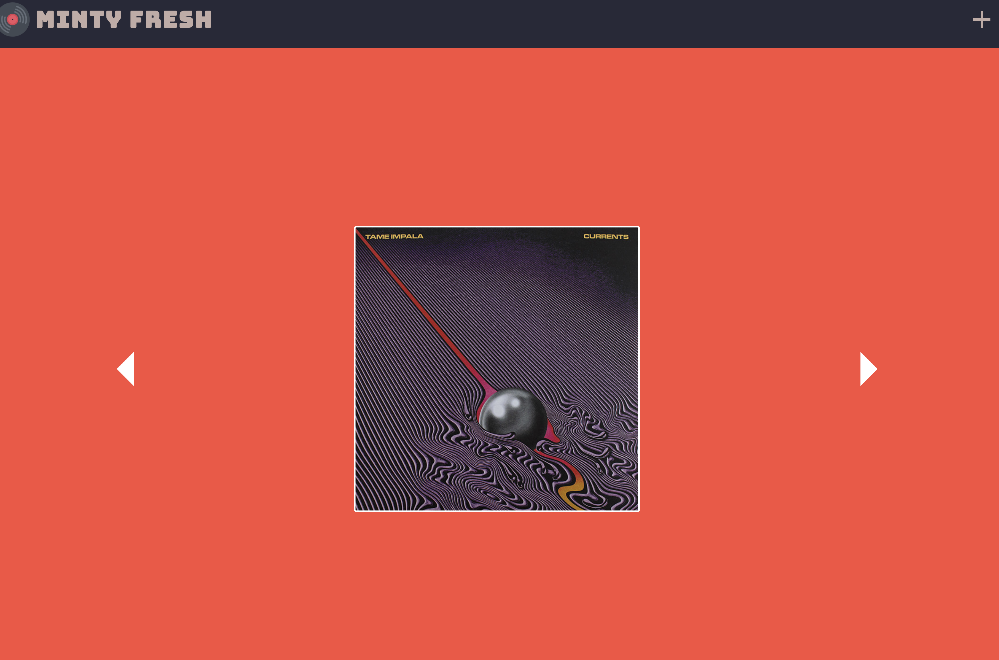

# Minty-Fresh

A site utilizing, SASS, CSS, and JavaScript to take in, display, and scroll through a user's record collection. This site features hard-coded data with room to integrate a database or API call into it.

## Getting Started

* open terminal
* $ cd Desktop
* $ git clone https://github.com/lewdavidson/Minty-Fresh.git
* $ open index.html

## Authors

* **Lew Davidson**  - [Lew Davidson](https://github.com/lewdavidson)
* **Luke Bertram**  - [Luke Bertram](https://github.com/lukebertram)

## License

This project is licensed under the MIT License - see the [LICENSE.md](LICENSE.md) file for details
This proaject was made by two students at Epicodus.
